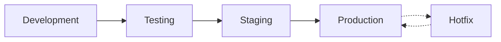

# Trabajo Práctico 7: Plan de Desarrollo y Mantenimiento

## Ingeniería y Calidad de Software - UTN FRM

### Información del Proyecto

**Asignatura:** Ingeniería y Calidad de Software  
**Trabajo Práctico:** N° 7 - "Plan de desarrollo y mantenimiento"  
**Grupo:** N° 6  
**Universidad:** Universidad Tecnológica Nacional - Facultad Regional Mendoza

---

## 👥 Integrantes del Grupo

| Legajo | Nombre y Apellido          |
| ------ | -------------------------- |
| 47833  | Mollaret, Brenda           |
| 43835  | de los Ríos, Carolina      |
| 43631  | Albino, Sergio             |
| 50069  | Lin, Hsin Yu               |
| 50071  | López, Leandro             |
| 50112  | Oberti Miras, María Lucila |
| 47751  | Carrizo, Martina           |
| 47742  | Chaparro, Pablo            |
| 49953  | Biondo, Juan Pablo         |

---

## 🎯 Objetivos del Trabajo Práctico

- **Comprender** el uso de un plan de desarrollo y mantenimiento
- **Utilizar** herramientas de automatización en el ciclo de vida de desarrollo
- **Implementar** pipelines de CI/CD con GitHub Actions
- **Aplicar** buenas prácticas de gestión de cambios y aseguramiento de calidad

---

## 📋 Conocimientos Previos Requeridos

- ✅ Elaboración de test unitarios
- ✅ Elaboración de tests automatizados
- ✅ Utilización de gestor de configuración (Git)
- ✅ Conceptos de CI/CD y DevOps

---

## 🛠️ Tecnologías Utilizadas

- **Frontend:** React + TypeScript + Vite
- **Testing:** Vitest (configurado)
- **Linting:** ESLint
- **Hosting:** Firebase Hosting
- **CI/CD:** GitHub Actions
- **Control de Versiones:** Git + GitHub

---

## 📁 Estructura del Proyecto

```
test-desarrollo-mantenimiento/
├── .github/
│   └── workflows/          # GitHub Actions pipelines
├── src/
│   ├── components/         # Componentes React
│   ├── tests/             # Pruebas unitarias
│   └── assets/            # Recursos estáticos
├── coverage/              # Reportes de cobertura
├── firebase.json          # Configuración Firebase
├── package.json           # Dependencias del proyecto
├── vite.config.ts         # Configuración Vite
├── tsconfig.json          # Configuración TypeScript
└── eslint.config.js       # Configuración ESLint
```

---

## 🔄 Plan de Desarrollo y Mantenimiento

### Gestión de Ramas (Branching Strategy)

El proyecto implementa un flujo de trabajo basado en **Git Flow** con las siguientes ramas principales:

#### 🌟 Ramas Principales

- **`main`**: Rama de producción - código estable y disponible para usuarios
- **`develop`**: Rama de desarrollo - integración de features del sprint actual
- **`hotfix/*`**: Ramas para mantenimiento correctivo inmediato
- **`feature/*`**: Ramas individuales para desarrollo de funcionalidades

### 🚨 Gestión de Incidencias

#### Clasificación por Severidad

| Severidad        | Acción                       | Ejemplos                                               |
| ---------------- | ---------------------------- | ------------------------------------------------------ |
| **S1 - Crítico** | Resolución inmediata (24/7)  | Vulnerabilidades de seguridad, caída total del sistema |
| **S2 - Alto**    | Resolución inmediata         | Funcionalidades clave (pagos, login)                   |
| **S3 - Medio**   | Siguiente release programado | Notificaciones con retraso                             |
| **S4 - Bajo**    | Siguiente release programado | Errores de tipeo, desalineación visual                 |

#### 🔧 Proceso de Hotfix

1. **Detección** → Reporte inmediato en Jira
2. **Evaluación** → Clasificación de severidad
3. **Rama Hotfix** → Creación desde `main`
4. **Desarrollo** → Fix con máxima prioridad
5. **Revisión** → Code review por pares
6. **Testing** → Pruebas en ambiente de testing
7. **Deploy** → Merge a `main` y deploy automático

---

## 🔍 Proceso de Revisión de Código

### Pull Requests a `develop`

- **Revisión por pares** entre desarrollador y colega
- Ambos deben aprobar para merge
- Ejecución automática de pipeline CI/CD

### Pull Requests a `main` (Release)

- **Revisión Técnica Formal (RTF)** con todo el equipo
- Discusión grupal de cambios
- Aprobación unánime requerida

### Hotfixes

- **Revisión expedita** entre desarrollador y tester
- Foco en solución rápida manteniendo calidad

---

## 🧪 Aseguramiento de Calidad

### Pruebas Automatizadas

- ✅ **Tests Unitarios**: Validación de componentes individuales
- ✅ **Tests de Integración**: Verificación de interacciones entre módulos
- ✅ **Tests End-to-End**: Simulación de flujos de usuario completos

### Pruebas Manuales

- 🔍 **Smoke Tests**: Verificación básica post-deploy
- 🔍 **Regression Tests**: Validación de funcionalidades existentes
- 🔍 **UAT**: Pruebas de aceptación con stakeholders

---

## 🌐 Ambientes de Desarrollo

### Flujo de Ambientes



1. **Development**: Ambiente local y ramas de desarrollo
2. **Testing**: Ambiente para QA y pruebas automatizadas
3. **Staging**: Ambiente para UAT y demostraciones
4. **Production**: Ambiente de usuarios finales

---

## 🚀 Pipeline CI/CD

### GitHub Actions Workflow

El pipeline automatizado incluye:

1. **🔍 Análisis de Código**

   - ESLint para buenas prácticas
   - Prettier para formateo
   - TypeScript compilation check

2. **🧪 Testing**

   - Ejecución de tests unitarios
   - Tests de integración
   - Generación de reportes de cobertura

3. **🏗️ Build**

   - Compilación de la aplicación
   - Optimización de assets
   - Generación de artifacts

4. **🚀 Deploy (Opcional)**
   - Deploy automático a Firebase Hosting
   - Solo en merges a `develop`
   - Notificaciones de deploy exitoso

### Protección de Ramas

- ❌ **Pushes directos bloqueados** a `main` y `develop`
- ✅ **Pull Requests obligatorios** con revisión
- ⏳ **Pipeline debe pasar** antes de merge
- 👥 **Aprobaciones requeridas** según rama destino

---

## 📊 Monitoreo y Métricas

### Métricas de Calidad

- **Cobertura de Tests**: Mínimo 80%
- **Tiempo de Build**: < 5 minutos
- **Tiempo de Deploy**: < 3 minutos
- **Mean Time to Recovery (MTTR)**: < 30 minutos para hotfixes

### Herramientas de Monitoreo

- GitHub Actions para builds
- Firebase Analytics para performance
- Coverage reports para calidad de código

---

## 📚 Comandos Útiles

```bash
# Instalación de dependencias
npm install

# Desarrollo en local
npm run dev

# Ejecutar tests
npm run test

# Ejecutar tests con coverage
npm run test:coverage

# Lint del código
npm run lint

# Formatear código
npm run format

# Build para producción
npm run build

# Preview del build
npm run preview
```

---

## 🎓 Lecciones Aprendidas

### Implementación de Pipelines

- La automatización reduce significativamente errores humanos
- Los branch protection rules son esenciales para mantener calidad
- Los tests automatizados brindan confianza en los cambios

### Gestión de Hotfixes

- La clasificación por severidad agiliza la toma de decisiones
- Tener un proceso claro reduce el tiempo de resolución
- La comunicación inmediata es crucial en incidencias críticas

### Trabajo en Equipo

- Las revisiones de código mejoran la calidad y comparten conocimiento
- Los ambientes separados permiten desarrollo sin riesgo
- La documentación clara facilita el onboarding de nuevos miembros

**UTN FRM - Ingeniería y Calidad de Software - 2025**
